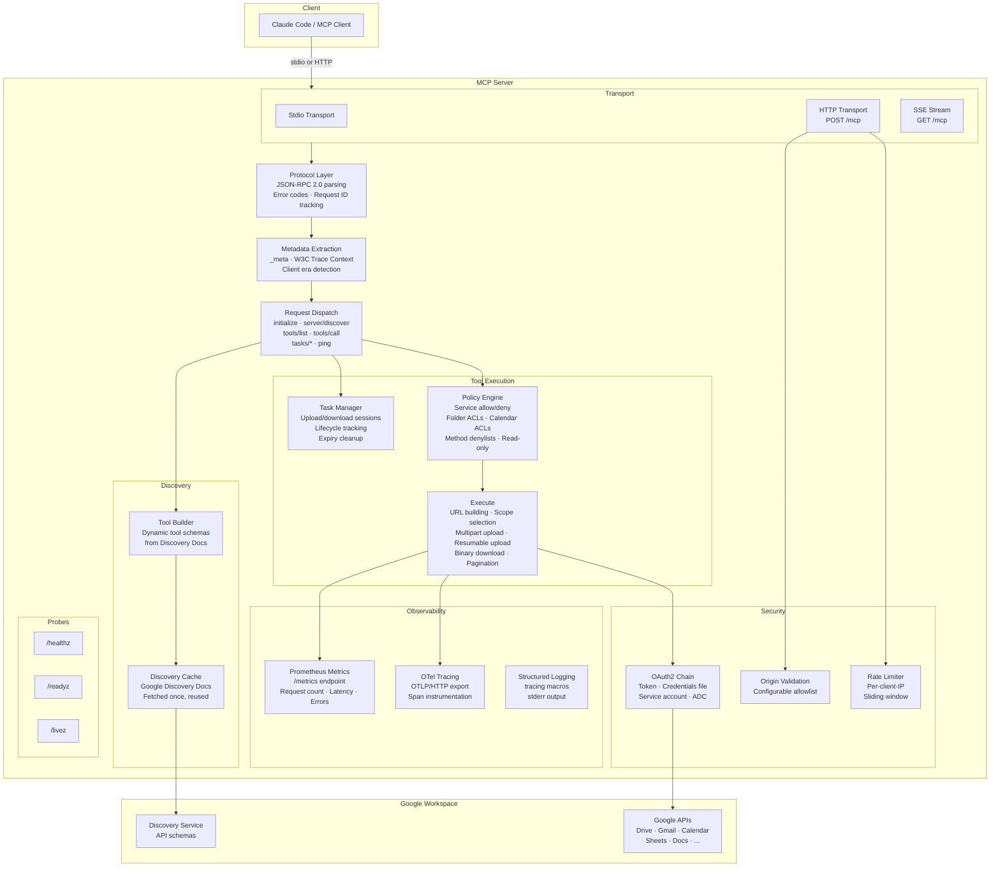
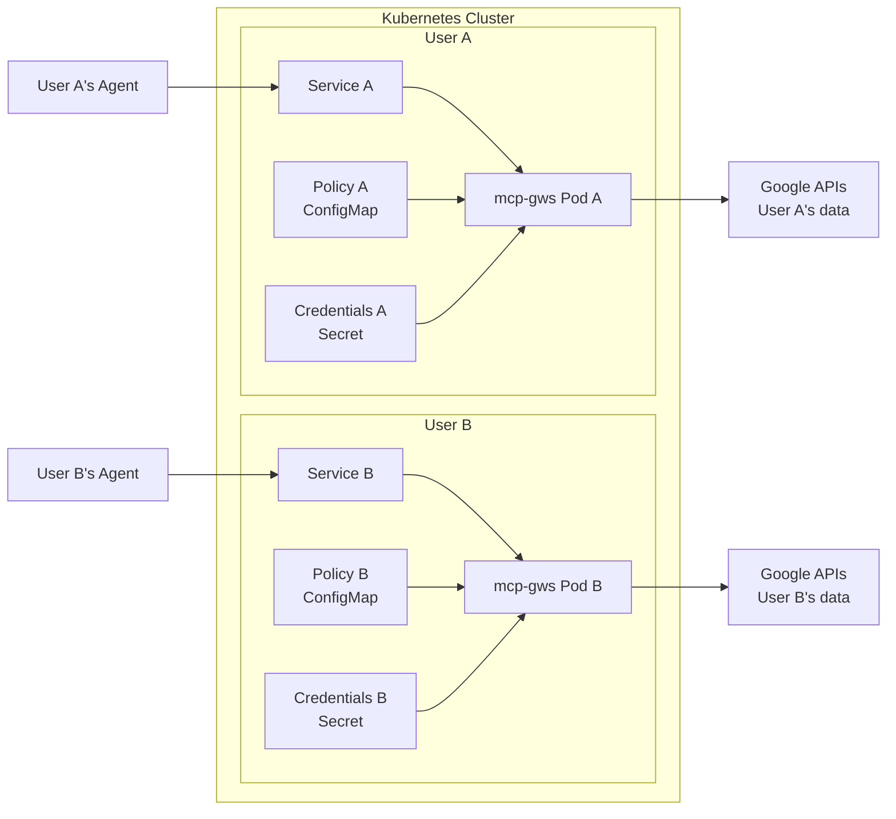

# Architecture

## Request Flow



## Module Map

```
src/
├── main.rs         CLI args, telemetry init, transport selection
├── server.rs       JSON-RPC loop (stdio), dual-era dispatch, task chunk handling
├── http.rs         Axum HTTP server, SSE, rate limiter, probes, metrics endpoint
├── protocol.rs     JSON-RPC types, error codes, request/response construction
├── meta.rs         _meta extraction, W3C Trace Context, client era detection
├── execute.rs      Google API execution, URL building, multipart/resumable upload, download
├── policy.rs       TOML policy engine, folder/calendar/method enforcement
├── tools.rs        Tool list generation from Discovery Docs, gws_discover handler
├── tasks.rs        Task lifecycle (working → completed/failed/cancelled)
├── metrics.rs      Prometheus counters, histograms, gauges
├── auth.rs         OAuth2 credential chain (token, file, service account, ADC)
└── resolve.rs      Drive folder path → ID resolution
```

## Multi-User Deployment

Each user gets their own server instance with their own credentials and policy:



This gives per-user isolation: different policies, credentials, rate limits, and no shared state.
